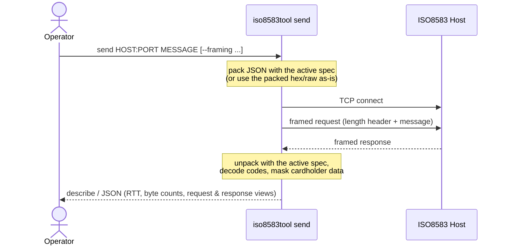

# iso8583tool

[](https://github.com/nao1215/iso8583tool/actions/workflows/build.yml)
[](https://github.com/nao1215/iso8583tool/actions/workflows/unit_test.yml)
[](https://github.com/nao1215/iso8583tool/actions/workflows/e2e_test.yml)
[](https://github.com/nao1215/iso8583tool/actions/workflows/reviewdog.yml)
[](https://github.com/nao1215/iso8583tool/actions/workflows/coverage.yml)
[](https://pkg.go.dev/github.com/nao1215/iso8583tool)
[](https://goreportcard.com/report/github.com/nao1215/iso8583tool)


A command-line tool for debugging and inspecting ISO 8583 payment messages.


```shell
iso8583tool view examples/basei/0110-auth-response.hex
iso8583tool diff examples/basei/0100-auth-request.hex examples/basei/0110-auth-response.hex
iso8583tool redact examples/basei/0100-auth-request.hex
```

Messages come from a file, `-`, or stdin, and JSON output pipes into `jq`:

```shell
iso8583tool view examples/basei/0110-auth-response.hex --format json | jq '.fields["39"]'
```

## Install

```shell
go install github.com/nao1215/iso8583tool@latest
```

Or build from a clone:

```shell
make build   # produces ./iso8583tool
```

## Quick Start

```shell
iso8583tool sample
iso8583tool view examples/basei/0110-auth-response.hex
iso8583tool validate examples/basei/0100-auth-request-unknown-tlv.hex
iso8583tool convert examples/basei/0100-auth-request.hex
iso8583tool send 127.0.0.1:8583 examples/basei/0800-network-echo.hex
```

A message is read from a file, `-`, or stdin. Flags may come before or after the
positional argument. Use `--` before a dash-leading filename.

## Commands

```text
view       Unpack and inspect a message
diff       Compare two messages field by field
redact     Mask PAN, track, and EMV sensitive data
convert    Convert between a packed message and a JSON document
send       Send a message over TCP and decode the response
validate   Check that a message unpacks and report issues
doctor     Detect which built-in spec preset fits a message
specs      List the built-in spec presets
sample     List or export built-in BASE I samples
version    Print the version
```

Every command defaults to the `basei-starter` spec. If a capture does not decode,
run `iso8583tool doctor MESSAGE` to find the preset that fits, then pass it with
`--spec`. `iso8583tool specs` lists the presets.

## `view`

Unpacks a message and prints its fields. Coded values are decoded, and
cardholder data is masked by default: the PAN, track, PIN, and EMV tags that
carry them, plus a PAN embedded in a free-form private field (such as F63).
Pass `--unsafe` to show the raw values for local fault analysis — this applies
to `describe`, `json`, and filtered output alike.


```shell
iso8583tool view examples/basei/0110-auth-response.hex
iso8583tool view examples/basei/0110-auth-response.hex --format json
iso8583tool view examples/basei/0110-auth-response.hex --filter 39 --filter 55.8A
iso8583tool view examples/basei/0110-auth-response.hex --unsafe
cat examples/basei/0110-auth-response.hex | iso8583tool view -
```

```text
$ iso8583tool view examples/basei/0110-auth-response.hex
Summary: 0110 · Approved · JPY 5000 · STAN 123456 · TERMID01
...
F2   Primary Account Number...: 411111******1111
F39  Response Code............: 00  → Approved
F49  Transaction Currency Code: 392  → JPY (Japanese yen)
55.8A Authorisation Response Code: 3030  → Approved
...
```

JSON output works with `jq`:

```shell
iso8583tool view examples/basei/0110-auth-response.hex --format json | jq '.fields["39"]'
```

`--filter` keeps the same object shape (`mti`, `fields`, `binary_fields`,
`summary`, `decoded`), scoped to the matched paths, and adds a
`missing_filters` array — always present, so a typo is distinguishable from an
absent field:

```shell
iso8583tool view examples/basei/0110-auth-response.hex --filter 39 --filter 90 --format json | jq '.missing_filters'
```

## `diff`

Compares two messages by field path, including nested EMV tags. Either side may
be `-` for stdin. Differences are detected on the real values, but the displayed
values are masked just like `view` (PAN to BIN + last four; track, PIN, unknown
TLV bytes, and a PAN embedded in a private field all hidden), so diff output is
safe to paste into a ticket. Pass `--unsafe` to show raw cardholder data for
local fault analysis.


```shell
iso8583tool diff examples/basei/0100-auth-request.hex examples/basei/0110-auth-response.hex
iso8583tool diff examples/basei/0100-auth-request.hex examples/basei/0110-auth-response.hex --filter 55
iso8583tool diff examples/basei/0100-auth-request.hex examples/basei/0110-auth-response.hex --format json | jq '.changes[].path'
iso8583tool diff examples/basei/0100-auth-request.hex examples/basei/0110-auth-response.hex --unsafe
```

```text
$ iso8583tool diff examples/basei/0100-auth-request.hex examples/basei/0110-auth-response.hex
MTI changed
- 0100
+ 0110

Field 12 changed
- 123456
+ 123457
...
```

## `redact`

Masks the PAN, track data, PIN, sensitive EMV tags, and a PAN embedded in a
free-form private field. Output is a sanitized document, not a re-packable
message. `redact` has no raw mode by design — it is the sanitizer, so use
`view --unsafe` or `diff --unsafe` when you need to see raw values.


```shell
iso8583tool redact examples/basei/0100-auth-request.hex
iso8583tool redact examples/basei/0100-auth-request.hex --format text
cat examples/basei/0100-auth-request.hex | iso8583tool redact -
```

```text
$ iso8583tool redact examples/basei/0100-auth-request.hex
{
  "mti": "0100",
  "fields": {
    ...
    "2": "411111******1111",
    "35": "411111****************************",
    ...
  },
  "binary_fields": {
    ...
    "55.9F26": "****************"
  }
}
```

## `convert`

Converts between a packed message and a JSON document. The direction is detected
from the input; use `--to json|hex` to force it.

```shell
iso8583tool convert examples/basei/0100-auth-request.json
iso8583tool convert examples/basei/0100-auth-request.hex
iso8583tool sample 0100-auth-request --format hex | iso8583tool convert
iso8583tool convert examples/basei/0100-auth-request.json --output out.hex
```

```text
$ iso8583tool convert examples/basei/0100-auth-request.hex
{
  "mti": "0100",
  "fields": {
    ...
    "2": "4111111111111111",
    ...
  },
  "binary_fields": {
    "55.9F02": "000000005000",
    ...
  }
}
```

Unknown Field 55 tags are preserved when converting. Unlike `view`, `diff`, and
`send` — which mask cardholder data by default — `convert` emits the document
**unmasked** so it round-trips, so the PAN, track, and PIN are in the clear.
Treat its output as sensitive and use [`redact`](#redact) to share it safely.
`convert --help` says the same, and a run prints a one-line reminder: in the
`--output` report, or on stderr when stdout is a terminal. Piped runs
(`convert | convert`, scripts) stay byte-clean. A document is rejected when a
path is ambiguous — the same path in both `fields` and `binary_fields`, or a
parent that also has nested children (for example `55` together with `55.9F02`,
or `48` with `48.1`) — because packing it would be order-dependent and silently
lossy.

## `send`

Sends one ISO 8583 message to a host over TCP and decodes the one response. It
is a focused probe for a test endpoint or simulator, with no listener, session,
retry, or sign-on logic.


The input is a JSON document (packed with the active spec) or an already-packed
hex/raw message, read from a file, `-`, stdin, or `--raw`. `--raw` takes an
inline message — a JSON document or a hex/raw string — not hex only.

`--framing` selects the length header, used for both request and response:

- `2byte-binary` (default) — a 2-byte big-endian length prefix.
- `4digit-ascii` — a 4-digit ASCII length header (`0094…`).
- `none` — no header; the request half-closes after the write and the response
  is read until EOF (the peer closes) or `--timeout`.

`--timeout` (default `5s`) bounds the connect and read. The request and response
are masked by default like [`view`](#view); `--unsafe` shows raw values.

`--dry-run` packs and frames the request, prints what *would* be sent (the
framing, the wire byte count, and the decoded request view), then exits without
opening a connection. It is the fast way to confirm a message packs under the
active spec before a real run; in an E2E script you can keep the same command
line and just drop the flag for the live send. A malformed `HOST:PORT` is
reported the same way with or without the flag. Because the framed wire bytes
carry the PAN/track/PIN in the clear, they are withheld by default; pass
`--unsafe` to also print the framed bytes (a `Framed bytes:` line, or `framed_hex`
in `--format json`) when you need to inspect exactly what would go on the wire.

For shell-based E2E or CI, assert on the decoded reply without piping through
`jq`: `--expect-mti VALUE` checks the response MTI, and `--expect-field
PATH=VALUE` (repeatable) checks a field. Assertions compare against the decoded,
**unmasked canonical** values — so an expectation on a masked field (a PAN, for
example) still matches its real value — and any mismatch prints a deterministic
`expected … got …` error on stderr and exits non-zero.

```shell
# Send a packed 0800 network echo and decode the 0810 reply (default framing).
iso8583tool send 127.0.0.1:8583 examples/basei/0800-network-echo.hex

# Pack a JSON document with the active spec, then send it with a 4-digit header.
iso8583tool send 127.0.0.1:8583 examples/basei/0100-auth-request.json --framing 4digit-ascii

# Send without a length header (read the reply until the peer closes or --timeout).
iso8583tool send 127.0.0.1:8583 examples/basei/0800-network-echo.hex --framing none

# Pass an inline message with --raw (JSON here; hex/raw also work).
iso8583tool send 127.0.0.1:8583 --raw '{"mti":"0800","fields":{"70":"301"}}'

# Verify the message packs and frames without sending it (no connection opened).
iso8583tool send 127.0.0.1:8583 examples/basei/0800-network-echo.hex --dry-run

# Assert the reply in CI: a non-zero exit on any mismatch, no jq required.
iso8583tool send 127.0.0.1:8583 examples/basei/0800-network-echo.hex \
  --expect-mti 0810 --expect-field 39=00

# Read the message from stdin and emit machine-readable JSON for jq.
iso8583tool sample 0800-network-echo --format hex \
  | iso8583tool send 127.0.0.1:8583 - --format json | jq '.response_view.mti'
```

```text
$ iso8583tool send 127.0.0.1:8583 examples/basei/0800-network-echo.hex
Sent to: 127.0.0.1:8583
Framing: 2byte-binary
Spec: basei-starter
Timeout: 5s
Sent bytes: 96  Received bytes: 108  RTT: 294µs

Request:
  Summary: 0800 · Echo test · STAN 654321 · TERMNET1
  0 = 0800  → Network management Request from Acquirer (ISO8583:1987)
  7 = 0604161616  → 06-04 16:16:16
  11 = 654321
  12 = 161616  → 16:16:16
  13 = 0604  → 06-04
  24 = 001
  41 = TERMNET1
  48 = HEARTBEAT=BASEI
  70 = 301  → Echo test

Response:
  Summary: 0810 · Approved · Echo test · STAN 654321 · TERMNET1
  0 = 0810  → Network management Response from Acquirer (ISO8583:1987)
  7 = 0604161616  → 06-04 16:16:16
  11 = 654321
  12 = 161617  → 16:16:17
  13 = 0604  → 06-04
  24 = 001
  39 = 00  → Approved
  41 = TERMNET1
  48 = HEARTBEAT=BASEI
  63 = ECHO=OK
  70 = 301  → Echo test
```

The describe view lists **every** present field — not only the codes that decode
to a human meaning — so a fault investigation surfaces fields like F37/F38/F41/F42/F48/F63,
consistent with [`view`](#view). Cardholder data is masked the same way (`--unsafe`
shows raw values).

`--format json` emits a machine-readable record: `remote_addr`, `framing`,
`timeout`, `rtt_ms`, `sent_bytes`, `received_bytes`, the `request` / `response`
(byte count, plus the raw wire `hex` only under `--unsafe`), and the decoded
`request_view` / `response_view` (the same shape as `view --format json`). All of
it is masked by default — the raw packed bytes carry the PAN in the clear, so
their hex is withheld unless you pass `--unsafe`.



## `validate`

By default, `validate` reports whether a message **unpacks**, any unknown TLV
tags, and the field path of an unpack failure. It does **not** assert that the
message is a complete, business-valid BASE I transaction — a message with only a
STAN can still unpack. Exit code is `0` for success or warnings, `1` for errors.

Add `--strict` for best-effort, message-class-aware semantic checks: required
and recommended fields per MTI (for example, a `0110` response must carry a
response code in field 39, an approved response should carry field 38, a
reversal needs field 90). Strict mode is a heuristic aid, not a substitute for
full network certification.

```shell
iso8583tool validate examples/basei/0100-auth-request-unknown-tlv.hex
iso8583tool validate examples/basei/0110-auth-response.hex --format json
iso8583tool validate examples/basei/0110-auth-response.hex --strict
```

```text
$ iso8583tool validate examples/basei/0100-auth-request-unknown-tlv.hex
Validation: ok
Spec: basei-starter
MTI: 0100  → Authorization Request from Acquirer (ISO8583:1987)
...
Issues:
- [warning] 55.DF8129: unknown TLV tag preserved for round-trip safety
```

A deliberately broken message is a **failure example**: it reports the error and
exits non-zero (use `--raw` to pass an inline message instead of a file):

```shell
$ iso8583tool validate --raw 01007220
Validation: failed
Hint: the message did not unpack under basei-starter; run `iso8583tool doctor` to detect the right spec
...
- [error] ...
$ echo $?
1
```

The hint appears whenever a message fails to unpack, since the usual cause is the
wrong spec. See [`doctor`](#doctor).

## `doctor`

ISO 8583 does not pin a wire encoding: the same bitmap can be ASCII, packed BCD,
or binary, and private fields differ per network. So a capture only decodes under
the spec it was produced with. `doctor` takes that guesswork out: it tries every
built-in preset and recommends the best fit, ranked by an exact byte-length round
trip, a clean unpack, a valid MTI, and the number of decoded fields. The input
encoding is auto-detected (hex text vs raw bytes), so a raw `.bin` capture works
without flags; override with `--encoding hex|raw` if the guess is wrong.

```shell
iso8583tool doctor examples/basei/0110-auth-response.hex
iso8583tool doctor message.bin
iso8583tool doctor examples/basei/0110-auth-response.hex --format json | jq .recommended
```

```text
$ iso8583tool doctor examples/basei/0110-auth-response.hex
Doctor: inspected 216 bytes
Recommended: --spec basei-starter

Candidates:
- basei-starter      recommended  MTI 0110, 16 fields, exact byte-length round trip
- spec87ascii        no           cannot unpack field 55: invalid ASCII char ...
- spec87bcd-starter  no           cannot unpack field 45: invalid syntax ...

Confirm with: iso8583tool view examples/basei/0110-auth-response.hex --spec basei-starter
```

`doctor` exits non-zero when no built-in preset can unpack the message, which
usually means it needs a custom `moov-io/iso8583` JSON spec. It only ranks the
built-in presets and can flag more than one as fitting, so confirm the result
with `view`. When `basei-starter` and `spec87ascii` tie — a message with no
Field 55 fits both — `doctor` names both and explains how to choose: they differ
only in Field 55 (EMV BER-TLV vs plain ASCII), so pick `basei-starter` if the
message carries EMV/ICC data in Field 55, otherwise `spec87ascii`. `validate`
points here when a message fails to unpack.

## `specs`

Lists the built-in presets that `--spec` accepts. Any `moov-io/iso8583` JSON spec
path also works as `--spec`.

```shell
iso8583tool specs
iso8583tool specs --format json | jq -r '.[].name'
```

```text
$ iso8583tool specs
Built-in spec presets (use with --spec NAME):

- basei-starter (default)
  BASE I Starter ASCII
  encoding: ASCII fields, ASCII-hex bitmap, field 55 as EMV BER-TLV
  Default. BASE I authorization/financial traffic with EMV ICC data in field 55.
...
```

## `sample`

Lists and exports the built-in BASE I fixtures.

```shell
iso8583tool sample
iso8583tool sample 0100-auth-request
iso8583tool sample 0100-auth-request --format hex --output 0100.hex
```

```text
$ iso8583tool sample
Available samples:
- 0100-auth-request: EMV authorization request with BASE I style private fields 48 and 62
- 0110-auth-response: EMV authorization response with issuer data in field 55 and opaque field 63
...
```

## Message document

`convert` and the JSON examples use this shape. `fields` holds text values,
`binary_fields` holds hex values, and keys are dot-paths. Fixed-length values
keep their padded form, so a document is easy to edit and pack back.

```json
{
  "mti": "0100",
  "fields": {
    "2": "4111111111111111",
    "4": "000000005000",
    "49": "392"
  },
  "binary_fields": {
    "55.9F02": "000000005000",
    "55.9F36": "0034"
  }
}
```

> [!NOTE]
> The PAN `4111111111111111` in the samples is a non-issued test number.

## BASE I defaults

The default spec is `basei-starter`: ASCII 1987 with Field 55 as EMV BER-TLV.
Samples live under [`examples/basei`](./examples/basei). `view` reports each
private field's strategy — how the active spec actually models it. In
`basei-starter`, field 55 is a BER-TLV composite and the other private fields are
plain values (`opaque`); the catalog note hints at the structured layout each
could take in a custom spec:

| Field | Shown as | Notes |
|-------|----------|-------|
| 48    | opaque   | plain value; suggest a positional overlay once the segment layout is fixed |
| 55    | tlv      | EMV BER-TLV, edited per tag; unknown tags preserved |
| 62    | opaque   | reserved private |
| 63    | opaque   | raw until the partner format is stable |
| 127   | opaque   | plain value; nested-bitmap territory for a custom spec |

A dot-path such as `48.1` works only when the active spec models field 48 as a
composite (a custom `--spec`), not under the plain-value built-in. Field 55 is
edited per tag, and unknown tags survive a round trip:

```shell
iso8583tool convert examples/basei/0100-auth-request-unknown-tlv.hex | iso8583tool convert | iso8583tool view - --filter 55.DF8129
```

## Other layouts

`--spec` switches the spec. `spec87ascii` is the plain ISO 8583:1987 ASCII
spec. `spec87bcd-starter` is a raw-binary starter for packed-BCD MTI/common
numeric fields plus a binary bitmap, which is useful for quiz-style fixtures
such as `kanmu/gocon-2022-spring/message.bin`. Any
[`moov-io/iso8583`](https://github.com/moov-io/iso8583) JSON spec works too. Run
[`iso8583tool specs`](#specs) to list the presets, or
[`iso8583tool doctor`](#doctor) to detect which one a capture uses.

```shell
iso8583tool view examples/spec87ascii/0800-network-echo.hex --spec spec87ascii
iso8583tool view message.bin --encoding raw --spec spec87bcd-starter
```

`--config` remains available for extension overlays and default bundles. The
`extensions` list **replaces** the built-in catalog, so list every private field
you want annotated, not just the one you are changing:

```json
{
  "spec": "basei-starter",
  "extensions": [
    { "id": 63, "name": "Acme Settlement Blob", "strategy": "opaque" }
  ]
}
```

`spec` in the config file is optional and can provide a default. The CLI
`--spec` flag overrides it when both are present. `strategy` is `opaque`,
`tlv`, `positional`, or `bitmap`. Omitting the `extensions` key keeps the
built-in catalog; setting it to an empty array (`"extensions": []`) disables
the catalog entirely, so no private fields are annotated.

A fuller worked overlay that relabels the private-field band (F48/F55/F62/F63/F127)
for a fictional acquirer lives at
[`examples/basei-overlay-config.json`](./examples/basei-overlay-config.json):

```shell
iso8583tool view examples/basei/0110-auth-response.hex --config examples/basei-overlay-config.json
```

## Fuzzing and property-based tests

Parsing untrusted input is fuzzed so malformed messages fail with an error
instead of crashing:

```shell
go test ./internal/service -run '^$' -fuzz=FuzzMessageToDocument
```

The service targets are `FuzzMessageToDocument`, `FuzzDiffMessages`,
`FuzzRedactMessage`, `FuzzConvertRoundTrip` (convert is a fixed point),
`FuzzValidateNoPanic`, and `FuzzViewNeverLeaksPAN` (the text view masks each
cardholder field exactly). Document parsing and rendering are fuzzed too —
`FuzzParseDocument`, `FuzzCanonicalPath`, `FuzzDecodeInput` (internal/messageio),
and `FuzzSanitizeControl` (internal/render). Crashing or failing inputs are kept
as regression seeds and replayed by `go test ./...`.

Property-based tests ([pgregory.net/rapid](https://pgregory.net/rapid)) assert
the higher-level invariants — convert round-trips, redact never leaks a
cardholder value and is idempotent, diff is symmetric and reflexive, hex
encode/decode are inverses, the masks preserve length, and strict validation is
monotonic. Run more cases with:

```shell
go test ./internal/service -run TestPBT -rapid.checks=20000
```

## Development

```shell
make test       # unit tests with coverage
make e2e        # atago end-to-end tests against a freshly built binary
make lint       # golangci-lint
```

README command examples are covered by the atago end-to-end tests under
[`e2e/atago/`](./e2e/atago). See [CONTRIBUTING.md](./CONTRIBUTING.md).

## License

MIT. See [LICENSE](./LICENSE).
